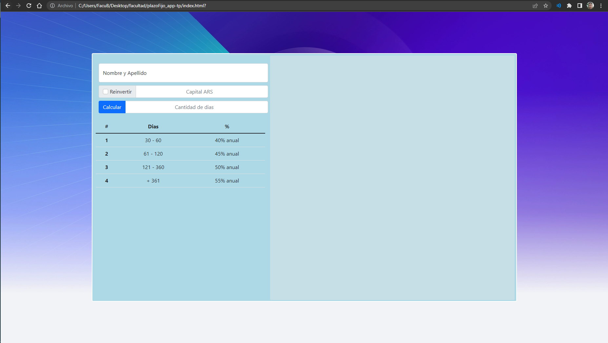
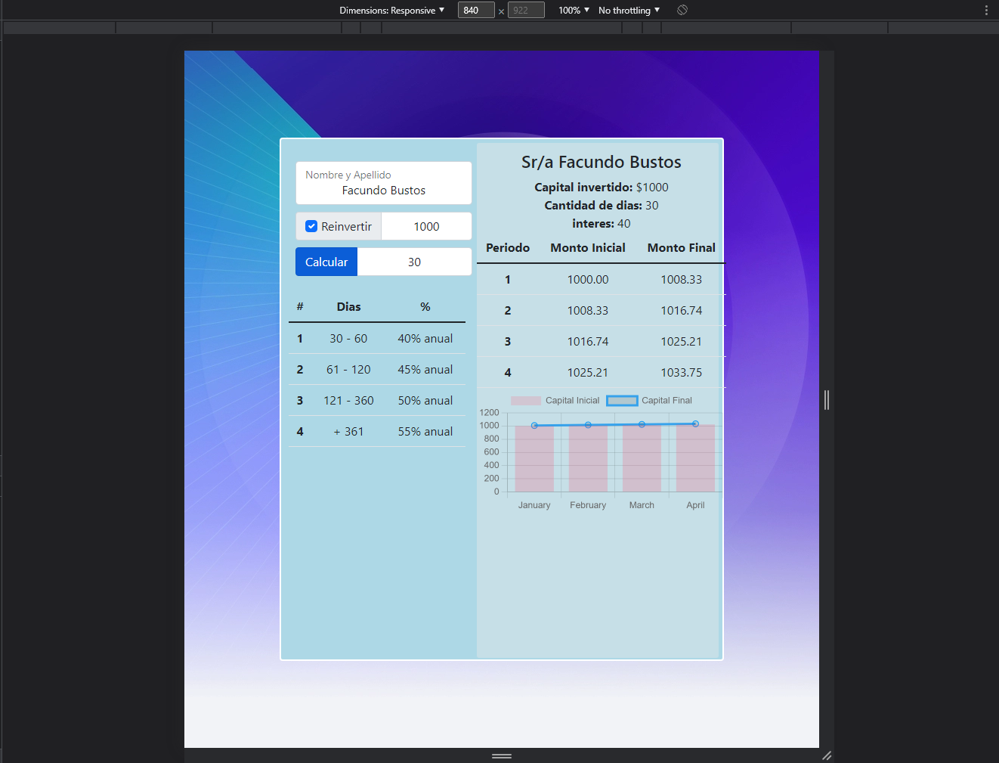
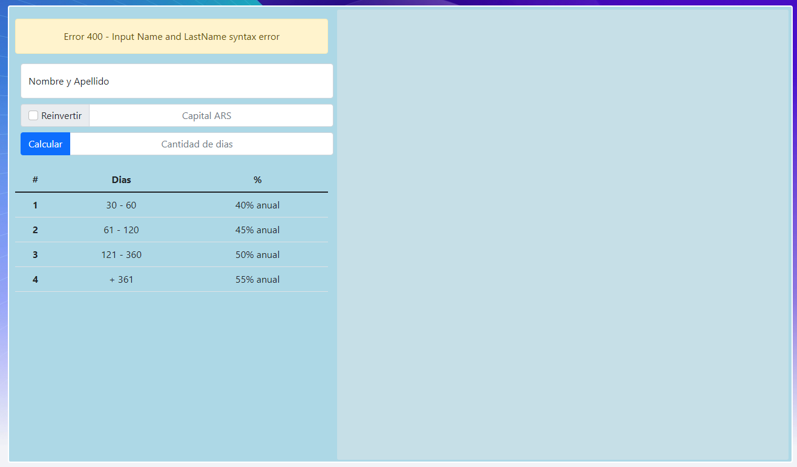
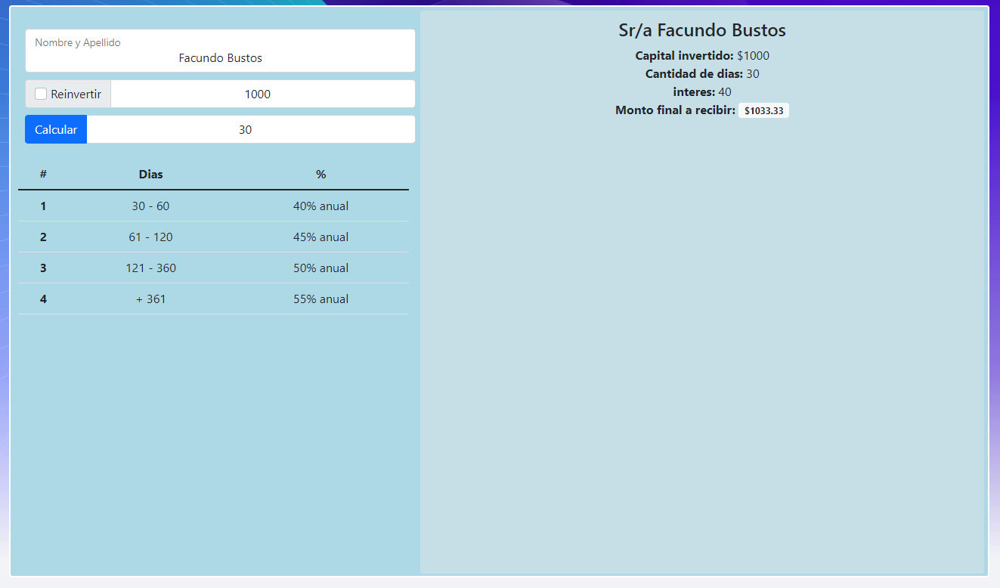
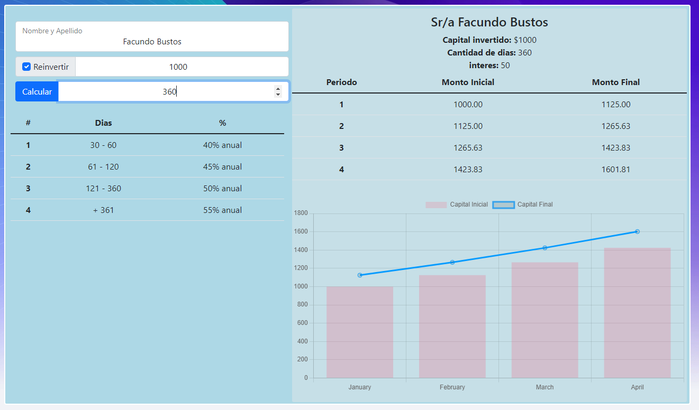
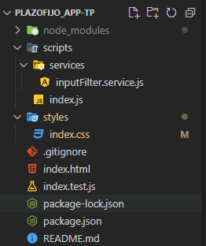
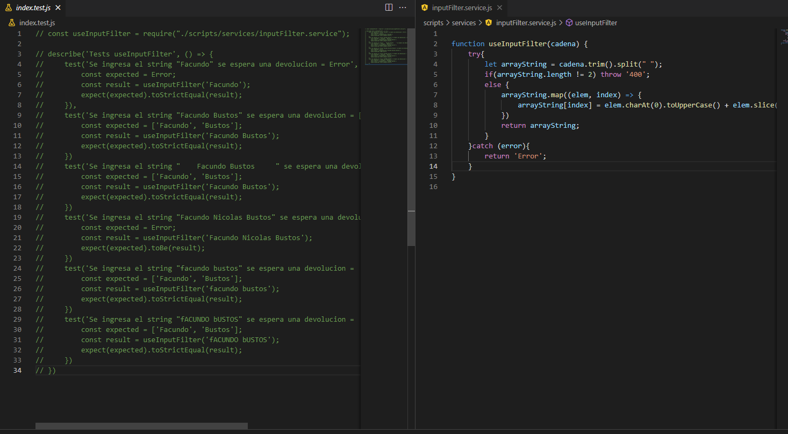

# Trabajo Practico Laboratorio de Computacion III
## Simulador de plazo fijo

## Indice
1. [Informacion General](#general-info)
2. [Tecnologias](#technologies)
3. [Operatividad](#installation)
4. [Screenshots](#screenshot)

<a name="general-info"></a>
### Informacion General

Ejercicio: Simulador de plazo fijo
El plazo fijo es una alternativa de inversión, en donde el ahorrista ingresa un monto de dinero, una cantidad de días, y al término de esos días recibe el monto inicial más intereses.

Deberá realizar un simulador de plazo fijo, en donde existan diferentes inputs donde se ingresará:
- Nombre y Apellido de la persona
- Monto a invertir
- Cantidad de días
- Si desea reinvertir el capital.

Al apretar el botón “Calcular”, deberá verificar que:
El nombre y apellido no sean vacíos.
El monto a invertir sea un número, y como mínimo $1000
Que la cantidad de días sea un número, y como mínimo 30.

Si alguna de esas validaciones es inválida, mostrar un mensaje indicando cual es el error.

Si todos los datos son correctos, se tiene que agregar un texto (o similar) debajo en donde indique el monto final que recibir. Este es determinado por la siguiente fórmula:
- monto final = monto inicial + (monto inicial * (cantidad días / 360) * (porcentaje / 100))

El porcentaje está determinado por la cantidad de días que se invierte:

Cantidad de días Porcentaje:
- 30 - 60 = 40%
- 61 - 120 = 45%
- 121 - 360 = 50%
- 360 - = 65%

Por último, si el usuario selecciona la opción de “reinvertir el capital”, se le deberá mostrar una tabla con lo que cobrará en los siguientes 4 períodos.

Consideraciones:
- NO hay que usar prompt para pedirle los datos al usuario, sino que el mismo deberá ingresarlos en los inputs, y el resultado se mostrará sólo cuando el usuario presione el botón “Calcular” (Ayuda: van a tener que usar un evento de javascript, y manejarlo).
- Evitar usar los alert para mostrar mensajes (por ejemplo, el mensaje de error). Es preferible agregar HTML de forma dinámica usando Javascript.

<a name="screenshot"></a>
### Screenshot










<a name="technologies"></a>
### Tecnologias
***

Lista de texnologias utilizadas en el proyecto:
* [Bootstrap](https://getbootstrap.com/): Version 5.1.3
* [Chart.js](https://www.chartjs.org/): Version 3.7.1
* [jest](https://jestjs.io/): Version 28.0.2


<a name="installation"></a>
### Operatividad
***

Una pequenia introduccion de como instalar el proyecto:
```
$ git clone https://example.com
$ npm i
$ npm run start

En caso de necesitar testear, utilizar los siguientes script:
```
$ npm run test
$ npm run test:watch 